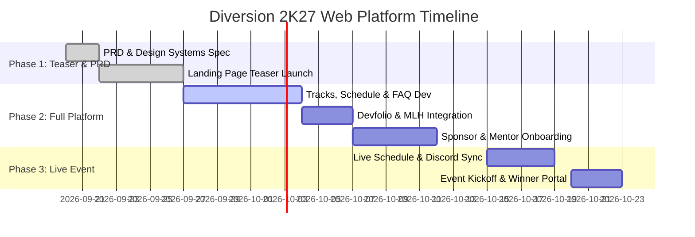

# Product Requirements Document (PRD): Diversion Web Platform

**Product Name:** Diversion Official Web Platform  
**Target Event:** Diversion 2K27 (West Bengal's Flagship MLH Hackathon)  
**Organization:** IEM-ACM Student Chapter under IEM-UEM Group  
**Reference Site:** [diversion.tech](https://diversion.tech)  
**Status:** Draft / Ready for Engineering Review  
**Version:** 1.0.0  

---

## 1. Executive Summary & Vision

### 1.1 Vision Statement
To build a world-class, immersive digital gateway for **Diversion**—West Bengal’s premier and first-ever Major League Hacking (MLH) sanctioned hackathon, powered by the IEM-ACM Student Chapter. The web platform serves as the central hub for registration, event navigation, track exploration, live announcements, mentor connections, and post-event achievements.

### 1.2 Event Background & Legacy
Diversion is recognized as India’s first AI-powered hackathon and West Bengal's flagship MLH hackathon. Building upon the success of past editions (such as Diversion 2K26 which garnered 7,000+ registrations, 500+ in-house hackers, and participants across 21+ cities and 30+ communities), Diversion 2K27 aims to elevate the experience block-by-block with a dynamic theme: **"Where the blueprints of imagination are built into reality."**

---

## 2. Product Objectives & Business KPIs

| Goal Area | Objective | Target KPI |
| :--- | :--- | :--- |
| **User Acquisition** | Drive event awareness & registrations nationwide | 10,000+ Total Registrations |
| **In-Person Attendance** | Convert online applications to qualified offline hackers | 600+ In-house Hackers at IEM Gurukul Campus |
| **Partner Engagement** | High-visibility showcase for Title, Gold, Silver & Community Partners | 40+ Sponsor & Community Partners onboarding |
| **User Experience** | Blazing-fast page speed & seamless Devfolio/MLH integration | < 1.5s First Contentful Paint (FCP), 99.9% Uptime during peak traffic |
| **Community Growth** | Expand Discord and social media footprint | 5,000+ Discord members join via platform links |

---

## 3. Target Audience & User Personas

### 3.1 Hackers / Student Developers
- **Profile:** High school, undergraduate, and graduate students with skills in Web Dev, Web3, AI/ML, Cloud Computing, and Design.
- **Needs:** Clear registration flow via Devfolio, transparent project rules, prize details, schedule tracking, mentor accessibility, and MLH Code of Conduct guidelines.

### 3.2 Mentors & Judges
- **Profile:** Industry experts, senior engineers, researchers, and alumni guiding teams and judging project submissions.
- **Needs:** Schedule clarity, track criteria, venue directions, and public recognition on the platform.

### 3.3 Sponsors & Corporate Partners
- **Profile:** Tech companies, Web3 protocols, cloud providers, and recruitment partners.
- **Needs:** Prominent tier placement, custom bounty/track showcases, link-backs, and talent access.

### 3.4 Event Organizers & Committee
- **Profile:** IEM-ACM student leaders, faculty advisors, and logistics coordinators.
- **Needs:** Easy-to-update announcement banner, real-time schedule adjustments, and scalable infrastructure.

---

## 4. Brand Identity & Design System Requirements

- **Theme & Aesthetics:** Modern Dark/Vibrant block-based aesthetic with retro-futuristic vibes ("Build your adventure block by block").
- **Color Palette:**
  - Background: Off-Black `#30302D`, Cream `#FCFBE8`
  - Accent Yellow: `#FEE12B` / `#F0D20E`
  - Accent Red: `#DE2E2E` / `#C70E0E`
  - Accent Cyan: `#61D4F1`
- **Typography:** Custom retro/display fonts (`Jersey 15`, `Chathura`) paired with clean sans-serif body typography.
- **Mascot Integration:** **LIGO**—The official Diversion mascot featured across interactive elements, background graphics, and empty states.

---

## 5. Functional Requirements & Feature Breakdown

### 5.1 Hero & Navigation Section
- **Fixed Glassmorphism Navbar:** Quick links to `Home`, `About`, `Tracks`, `Prizes`, `Schedule`, `Mentors`, `Patrons`, `FAQ`, and `Contact`.
- **Mascot & Tagline Display:** Interactive intro featuring LIGO, countdown timer to hackathon kickoff, and event dates (e.g., Feb 28 - March 1 at IEM Gurukul Campus).
- **Primary CTAs:** Direct action buttons for "Register on Devfolio" and "Apply via MLH".

### 5.2 About & Key Achievements ("Hall of Fame")
- **Narrative Section:** Highlighting the ethos of Diversion ("Where blueprints of imagination are built into reality").
- **Stat Counter Grid:**
  - **7,000+** Registrations
  - **500+** In-House Offline Hackers
  - **21+** Cities Represented
  - **30+** Partner Communities
  - **India's 1st** AI-Powered Hackathon
  - **West Bengal's 1st** MLH Hackathon

### 5.3 Tracks & Challenges Portal
Interactive cards displaying track requirements, sponsor bounties, and technical focus areas:
1. **Artificial Intelligence & Machine Learning:** GenAI, LLMs, Computer Vision, Autonomous Agents.
2. **Web3 & Blockchain:** Smart Contracts, DeFi, Decentralized Identity, dApps.
3. **Web & App Development:** Full-stack web applications, progressive web apps, cross-platform mobile apps.
4. **Cloud & DevOps Infrastructure:** Serverless architectures, microservices, containerized deployments.
5. **Open Innovation & Social Good:** Hack for sustainability, accessibility, and community impact.

### 5.4 Prize Matrix & Bounties
- **Overall Prizes:** Cash prizes for Winner (₹25,000), 1st Runner-Up (₹15,000), 2nd Runner-Up (₹10,000).
- **Track & Category Bounties:** Specific track cash awards, specialized hardware/cloud credits.
- **Perks for All Participants:** Official MLH swag, certificates, free food & accommodation for offline participants, mentor guidance sessions.

### 5.5 Interactive Event Schedule
- **Multi-Day Timeline:** Tabbed view covering Check-in, Opening Ceremony, Hacking Sprints, Mentoring Round 1 & 2, Mini-Games/Midnight Snacks, Pitching Rounds, and Closing Ceremony.
- **Filter & Search:** Filter timeline events by stage (Hacking, Workshops, Food Breaks, Judging).

### 5.6 Mentors, Judges & Team Lineup
- **Mentors & Judges Carousel/Grid:** Photo cards with names, titles, affiliations, and social/LinkedIn links.
- **Organizing Committee Showcase:** Highlighting Tech Lead, Design Lead, PR Lead, Logistics Lead, and Faculty Advisors.

### 5.7 Patrons & Institutional Leadership
- **Leadership Section:** Words from Chief Patron, Dean of Academics (IEM Kolkata), HOD ECE, and IEM-ACM leadership.

### 5.8 Partners & Sponsors Showcase
- Structured grid sorted by tier hierarchy:
  - **Title Partners**
  - **Elite & Gold Partners**
  - **Silver Partners**
  - **Community Partners** (30+ partner logos)

### 5.9 FAQ & MLH Compliance Hub
- Accordion-style collapsible FAQ covering:
  - *What is Diversion?*
  - *How can I register and what is the fee (100% Free)?*
  - *Can beginners participate?*
  - *Is prior project work allowed? (Strictly prohibited)*
  - *Team size requirements (1 to 4 members)*
- **MLH Code of Conduct Banner:** Direct mandatory link and compliance declaration.

### 5.10 Contact & Social Community Links
- Embedded links & action buttons for:
  - **Discord:** Direct invite link to official server
  - **Email Support:** Direct mailto link
  - **Phone Hotline:** Organizing team contact numbers
  - **Location Map:** Embedded Google Map for IEM Gurukul Campus, Salt Lake, Kolkata.

---

## 6. Non-Functional Requirements (NFRs)

### 6.1 Performance & Speed
- FCP (First Contentful Paint) < 1.5s, LCP (Largest Contentful Paint) < 2.5s.
- Assets (images, fonts, scripts) optimized and served via CDN.
- Dynamic asset lazy-loading for heavy visuals & mascot animations.

### 6.2 Scalability & Availability
- Serverless or Static Site Generation (SSG) hosting (e.g., Vercel, Netlify, Cloudflare Pages, or AWS S3+CloudFront).
- Capable of sustaining traffic bursts up to **15,000 concurrent requests** during registration deadlines and live winner announcements.

### 6.3 Responsiveness & Cross-Browser Compatibility
- Mobile-first, fully responsive design tested on iOS (Safari), Android (Chrome), and Desktop browsers (Chrome, Firefox, Edge, Brave).
- Seamless behavior across viewports ranging from 320px to 4K displays.

### 6.4 Security & Data Privacy
- 100% HTTPS enforced with TLS 1.3.
- No storage of sensitive credentials on frontend; external forms handled securely via Devfolio / official APIs.
- Protection against XSS, clickjacking, and mime-sniffing via proper HTTP headers.

---

## 7. Technical Stack & Architecture Recommendation

| Layer | Recommended Technology |
| :--- | :--- |
| **Framework** | Next.js (App Router) or Vite + React |
| **Styling** | Vanilla CSS / CSS Modules / Tailwind CSS with custom design tokens |
| **Animations** | Framer Motion / GSAP for smooth block transitions |
| **Icons & Fonts** | Lucide React / FontAwesome, Google Fonts (`Jersey 15`, `Inter`) |
| **Hosting & CDN** | Vercel / Cloudflare Pages |
| **Integrations** | Devfolio SDK / Widget, MLH Trust Badge, Discord Webhooks |

---

## 8. Development & Event Milestones

---

## 9. Verification & Acceptance Criteria

1. **Functional Completeness:** All sections (Hero, About, Stats, Tracks, Prizes, Timeline, Mentors, Patrons, Sponsors, FAQ, Contact) rendered accurately.
2. **Registration Integration:** Clicking "Register" successfully redirects to Devfolio/MLH application flow.
3. **MLH Compliance:** MLH badge & Code of Conduct link visible on all pages.
4. **Mobile Responsiveness:** Zero horizontal scrolling or overlapping elements on mobile devices.
5. **SEO & Open Graph Validation:** Meta tags correctly display Diversion 2K27 preview image and description on Twitter, LinkedIn, and Discord embeds.

---

*Document prepared for IEM-ACM Student Chapter & Diversion 2K27 Tech Team.*
